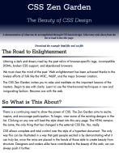
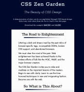
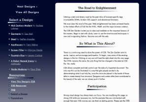
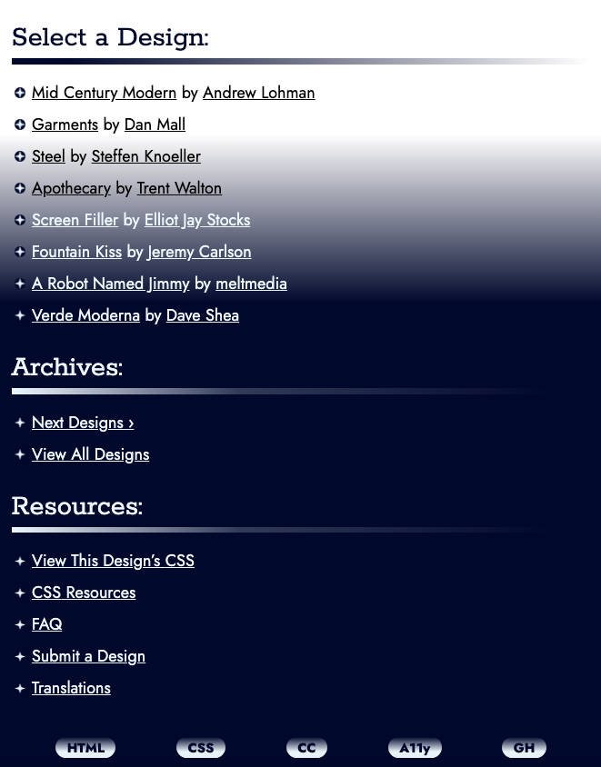
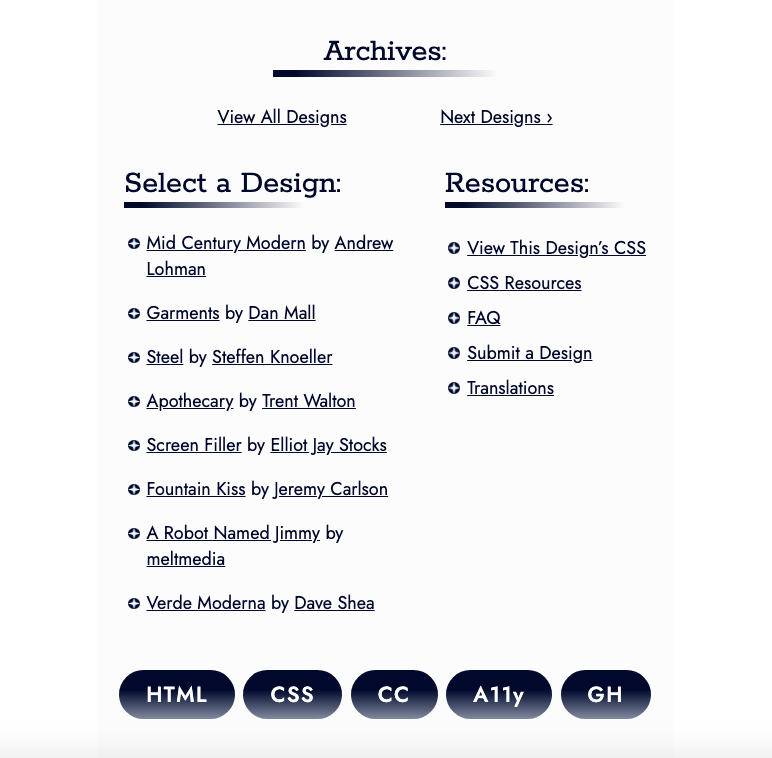
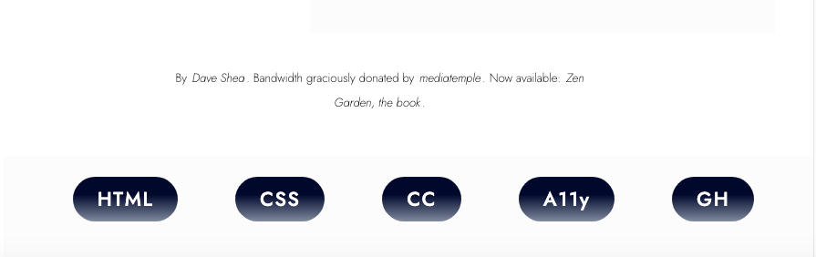

# My Take on CSS Zen Garden

## Table of Contents
[Introduction](#Introduction)

[Motivation](#Motivation)

[Design](#Design)

[Screenshots](#Screenshots)

[HTML Changes](#HTML-Changes)

[What I Learned](#What-I-Learned)

[Acknowledgements](#Acknowledgements)

## Introduction

CSS Zen Garden is place on the ewb to show the power of CSS. It shows can CSS can be used to create aesthetically pleasing websites and show how to implement different techniques pushing the boundaries of design 

## Motivation

I was motivated to create a design to challenge my own CSS skills and creativity to create something new. Since this this project was created several years ago CSS has changed, I took this challenge as way to practice my desing skills for as many browsers and versions of browsers as possible. Also designing fall backs for elements that are not widely supported.

## Design

I used this as a challenge to get more familiar with gradients and how they can be used in a website. Without interferring or creating barriers between the user and the content. I began with mobile first, creating the design for the smallest screen size and the adjusting for larger screen sizes.

I chose the theme gradients for this projects to create a unique visually appealing design. Gradients add depth and dimension to a webpage while being an effective use of color. I used gradients as both a background and accents for this design. Using a gradeint to create breaks and create structure in the content for the webpage. Adding a hover state with link, showing a gradient underline when the user hover on the link. 

Using a gradient creates a challenge of constrast. The text on the webpage must be easily read by users. As the color of the gradient changes there needs to be contrast so the text remains readable to the user. I used 2 different techniques to accomplish this goal. 

On the smallest screen size a gradient is used on the header and footer with a white background on the main content. Starting start dark and going to white on the header and then starting white and going dark on the footer. On the medium and large screen size the background for the whole webpage is a gradient with main section has a white background. The biggest challenge for constrast was on the largest screen size was creating the aside. When the aside starts the background is dark and then moves to light, necessitating a color change on the text to create enough contrast for the user to be able to easily read the text. 

## Screenshots

Beginning of web page
  

End of web page

  

## HTML Changes

While one constrainst is not to change the HTML, one my goals was to make this site accessible. Given it's age practices around accessible and designing for accessibility have expanded to make websites accessible to all users. The only changes I made to the HMTL was to make the site more accessible for users. I removed the header and footer elements from the div they were nested in to create landmarkers for users the use screen readers.

## What I Learned
I found in this challenge I learned how to use more CSS selectors. Part of the challenge is not alter the HTML I could not just add a class to a tag. I used a variety of selector combinations including child, sibling, as well as using CSS to create pseudo elements.

## Acknowledgements
CSS Zen Garden site for providing the html file and css starter file.