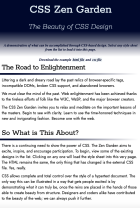
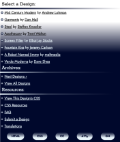
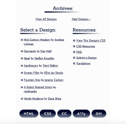
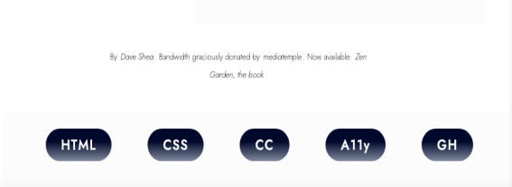

# My Take on CSS Zen Garden

## Table of Contents
[Introduction](#Introduction)

[Motivation](#Motivation)

[Design](#Design)

[Screenshots](#Screenshots)

[HTML Changes](#HTML-Changes)

[What I Learned](#What-I-Learned)

[Acknowledgements](#Acknowledgements)

## Introduction

CSS Zen Garden is place on the ewb to show the power of CSS. It shows can CSS can be used to create aesthetically pleasing websites and show how to implement different techniques pushing the boundaries of design 

## Motivation

I was motivated to create a design to challenge my own CSS skills and creativity to create something new. Since this this project was created several years ago CSS has changed, I took this challenge as way to practice my design skills for as many browsers and versions of browsers as possible. Also designing fall backs for elements that are not widely supported.

## Design

I chose the theme gradients to stretch my CSS skills in creating a unique visually appealing design. I used gradients as both a background and accents in this design. A gradeint were used as breaks to create structure in the content of the webpage. A hover state was added to links, showing an underline gradient when the user hovers on the link. 

Using a gradient created a challenge when designing, it makes contrast a little harder. The text on the webpage must be easily read by users. As the color of the gradient changes there needs to be contrast so the text remains readable to the user. I used 2 different techniques to accomplish this. 

The first technique I used was to put the text of the main content in its own container on a light background. This also helped to create structure showing it was different than other content.

The biggest challenge was creating contrast on the largest screen size. When the aside content begines the background is dark and then moves to light, necessitating a color change on the text to create enough contrast for the user to be able to easily read all the text. 

## Screenshots

Beginning of web page
  

End of web page

  

## HTML Changes

While one constrainst is not to change the HTML, one my goals was to make this site accessible. Given it's age practices around accessible and designing for accessibility have expanded to make websites accessible to all users. The only changes I made to the HMTL was to make the site more accessible for users. I removed the header and footer elements from the div they were nested in to create landmarkers for users the use screen readers.

## What I Learned
I found in this challenge I learned how to use more CSS selectors. Part of the challenge is not alter the HTML I could not just add a class to a tag. I used a variety of selector combinations including child, sibling, as well as using CSS to create pseudo elements.

## Acknowledgements
CSS Zen Garden site for providing the html file and css starter file.