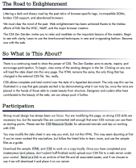
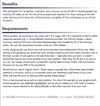
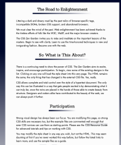
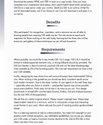

# CSS Zen Garden 

## My Take on CSS Zen Garden

## Table of Contents
[Introduction](#Introduction)

[Motivation](#Motivation)

[Design](#Design)

[Screenshots](#Screenshots)

[Built With](#built-with)

[HTML Changes](#HTML-Changes)

[What I Learned](#What-I-Learned)

[Acknowledgements](#Acknowledgements)

## Introduction

CSS Zen Garden is a place on the web to show the power of CSS. It shows can CSS can be used to create aesthetically pleasing websites and show how to implement different techniques pushing the boundaries of design.  

## Motivation

I was motivated to create a design to challenge my own CSS skills and creativity to create something new. Since this project was created several years ago CSS has changed, I took this challenge as a way to practice my design skills for as many browsers and versions of browsers as possible. 

## Design

I chose the theme gradients to stretch my CSS skills in creating a unique visually appealing design. I used gradients as both a background and accents in this design. A gradient accent was used as breaks to create structure in the content of the webpage. A hover state was added to links, showing an underline gradient when the user hovers on the link. 

The gradient theme created a challenge when designing- making sure there is contrast. The text on the web page must be easily read by users. As the color of the gradient changes there needs to be contrast so the text remains readable to the user. I used 2 different techniques to accomplish this. 

The first technique I used was to put the text of the main content in its own container on a light background. This also helped to create structure showing it was different from other content, and stood out from the other content. For smaller screen sizes this separated the content of the header, aside, and footer. There was not a color change within those sections. 

The biggest challenge was creating contrast on the largest screen size. When the aside content begins the background is dark and then moves to light, necessitating a color change on the text to create enough contrast for the user to be able to easily read all the text. 

## Screenshots

Beginning of web page  

  

Main Content Small Screen Sizes  

 

Main Content Medium and Large Screen Sizes  

 

End of web page  

  

## Built With
- HTML
- CSS

## HTML Changes

One constraint is not to change the HTML of this project, one of my goals was to make this site accessible. Given when this project was created, practices around accessibility and designing for accessibility have expanded to make websites accessible to all users. The only changes I made to the HTML was to make the site more accessible for users. I removed the header and footer elements from the div they were nested in to create landmarks for users that use screen readers.

Another change I made was to use semantic HTML. I looked through the HTML file, seeing where there was a div tag used if a semantic HTML element would fit, and then I changed it. I used elements such as section and article. I also created a main element with the main content for the web page. It helps define the semantic structure of the web page, making it more accessible for users. 

## What I Learned
Part of the challenge is not to alter the HTML. That means not just adding a class or id to a tag. I used a variety of selector combinations including child, sibling, as well as using CSS to create pseudo elements. I was able to practice using different combinations of CSS selectors to select one or more child elements while not selecting other similar  child elements to apply styles to.

I also learned how to create a responsive layout without changing the HTML. Since I was only changing the HTML for accessibility I had to create a responsive layout without changing the HTML. I found using grid to for the whole page as well as a nested grid created a responsive accessible layout.    

## Acknowledgements
CSS Zen Garden site for providing the html file and css starter file.
